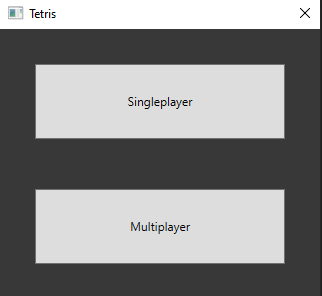
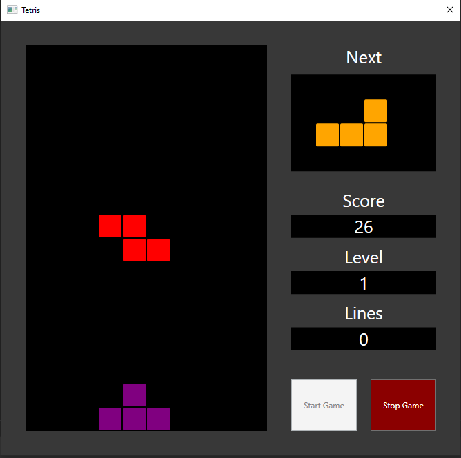
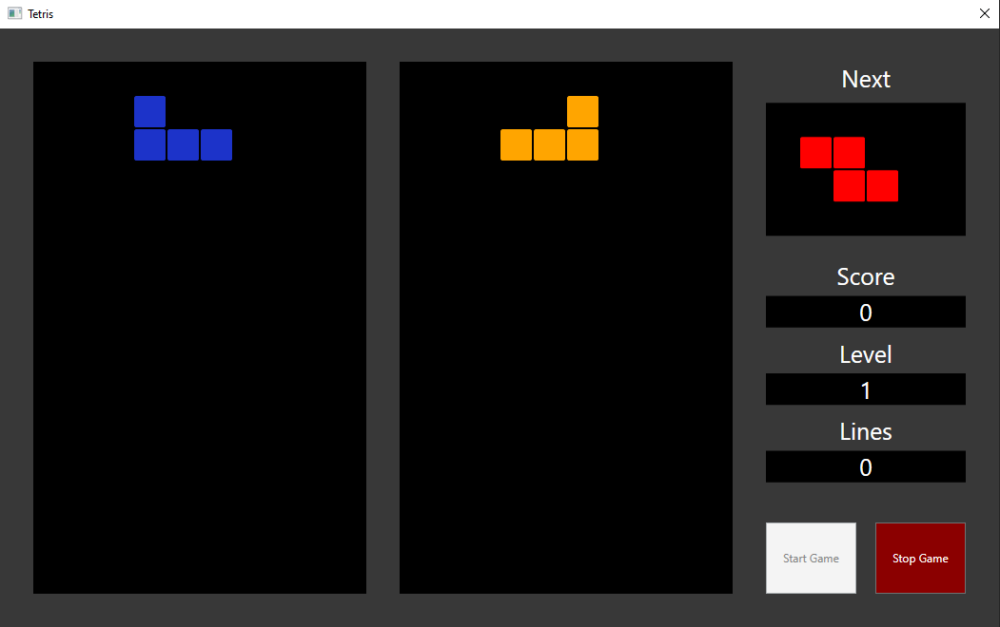

# Tetris-NET
Tetris game in C# with multiplayer over signalR to demonstrate .NET ecosystem and library knowledge

# Tetris
Playable Tetris with (simple) multiplayer functionality.

## How to play
This tetris game makes use of a custom keyboard layout (no reason as to why).

The controls are as following:
- A: left
- B: right
- S: soft drop
- R: rotate
- Shift + R: rotate counterclockwise
- Space: hard drop

## Functionality
- Soft dropping shapes.
- Hard dropping shapes.
- Rotating shapes.
- Scoring based on [modern](https://tetris.com/play-tetris) tetris.
- Clearing lines.
- Levels based on lines cleared (10 lines).

## Limitations
The multiplayer game can introduce desync issues when moving too quickly. However, since that is not the main goal of this project, it doesn't really matter.

## Screenshots

### Menu

### Singleplayer

### Multiplayer

